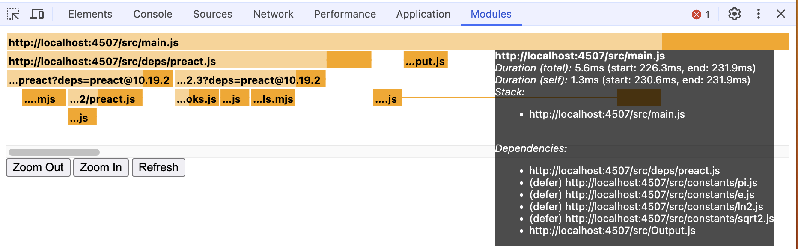
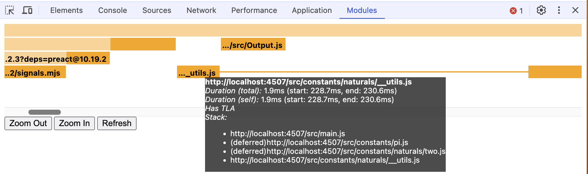
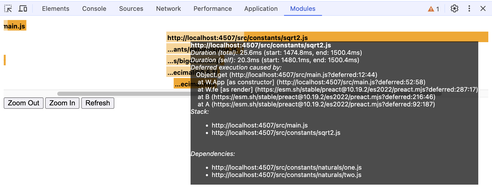
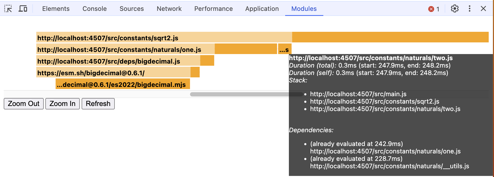

# Import defer polyfill & devtool

- `index.html` and `./src` contain a demo app
- `./tools` contains the service worker that implements `import defer` support and tracks module execution
- `./extension` contains a Chrome extension that implements the new _Modules_ devtools panel

### Instructions

- serve from the root of this repository
- install `./extension` as an unpacked extension

### Devtool features

- Show how long each module took to execute. For async module, distinguish actual top-level execution from time spent waiting
- Show how long the dependencies of each module took to execute
- Show why a given module is executed
- Show the list of imports of each module, including whether they are deferred or not
- Show which dependencies of a module have already been evaluated
